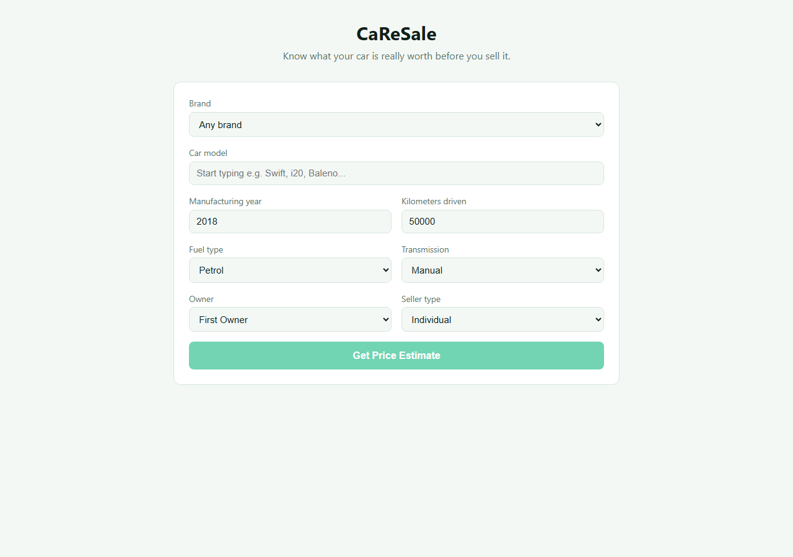
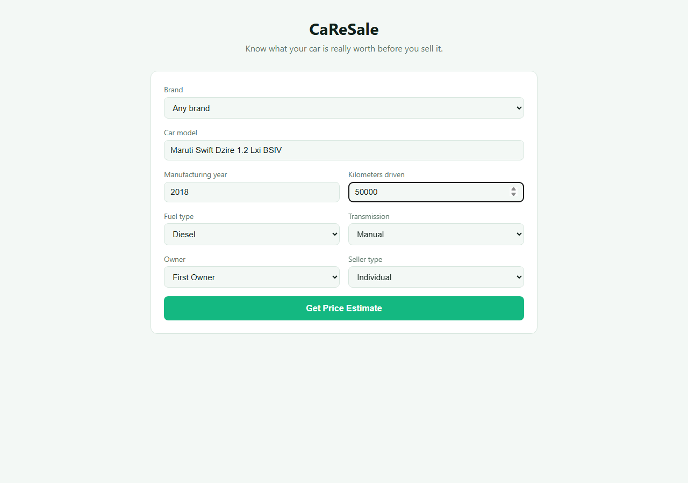
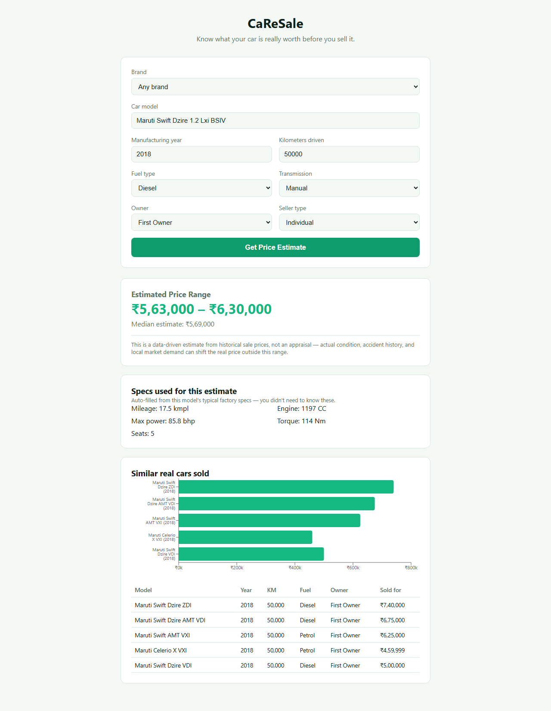

<p align="center">
  <h1 align="center">CaReSale</h1>
  <p align="center"><strong>Know what your car is really worth before you sell it.</strong></p>
  <p align="center">
    A self-trained machine learning model — not an LLM wrapper — that predicts a realistic
    used-car resale price range for the Indian market from real historical sale listings.
  </p>
  <p align="center">
    <a href="https://caresale.zrik.tech">
      
    </a>
  </p>
  <p align="center">
    
    
    
    
    
    
    
  </p>
</p>

---

<table>
  <tr>
    <td></td>
    <td></td>
  </tr>
  <tr>
    <td align="center"><em>Landing — brand/model search, year/km/fuel inputs</em></td>
    <td align="center"><em>Filled in — a real 2018 Maruti Swift Dzire diesel example</em></td>
  </tr>
  <tr>
    <td colspan="2"></td>
  </tr>
  <tr>
    <td colspan="2" align="center"><em>Result — price range, auto-filled specs, and real comparable listings</em></td>
  </tr>
</table>

---

## Why This Project

Every other project in this portfolio (kGPT, PptGen, ClauseGuard) is built around calling an
LLM API (Gemini/Groq). CaReSale is deliberately different: it's a **from-scratch trained
model** — full EDA, feature engineering, model comparison, hyperparameter tuning, and
quantile regression — wrapped in the same FastAPI + React stack used everywhere else. The
goal was a genuinely useful tool with an objective, checkable ground truth (real historical
sale prices), not a subjective judgment call.

---

## Features

| # | Feature | Description |
|---|---------|-------------|
| 1 | **Price range, not a single number** | Quantile regression (10th/50th/90th percentile) gives an honest range instead of false-precision point estimate |
| 2 | **Auto-filled technical specs** | Real sellers don't know their car's exact engine CC / max power / torque — these are looked up from the model's typical factory specs, not asked directly |
| 3 | **Real comparable listings** | Shows actual sold cars matching brand/age/mileage alongside the prediction, for trust-building |
| 4 | **Searchable model autocomplete** | Type "swift" and get every matching variant from ~2,500 known car names |
| 5 | **Mobile responsive** | Full form + results usable on a phone, verified at 390px viewport |

---

## The Model

Trained in a fully-executed, structured Jupyter notebook (`notebooks/car_price_prediction.ipynb`) —
every EDA plot and model metric below is a real output, not a mockup.

**Data**: Combined two real CarDekho used-car listing exports (4,340 + 8,128 rows), deduplicated
down to ~12,400 unique listings after removing exact re-scraped duplicates.

**Pipeline**: messy real-world data cleaning (parsing `"23.4 kmpl"`, `"1248 CC"`, and three
different torque string formats into clean numerics) → EDA → feature engineering → 8-model
comparison → hyperparameter tuning → quantile regression.

| Model | Test R² (log-price) |
|-------|---------------------|
| Linear Regression / Ridge / Lasso | ~0.78 (baseline) |
| Random Forest | 0.891 |
| Gradient Boosting | 0.888 |
| **XGBoost** | **0.904** |
| LightGBM | 0.903 |
| CatBoost | 0.898 |
| **Tuned LightGBM (final)** | **0.905**, MAE ≈ ₹80,600 |

**Two real bugs found and fixed during build-out** (both worth noting since they'd silently
degrade a "looks fine" demo):
- 21% of car model names (528 of 2,510) had partially-missing spec data — the original
  per-model lookup fell back to brand-level averages only when a model was *entirely*
  missing, not when it had some `NaN` columns. Fixed to fall back per-column.
- 25% of training rows were exact duplicate listings (same car re-scraped across sources),
  which made the "similar cars sold" feature show the same car repeated instead of diverse
  comparables. Fixed by deduplicating before ranking.

**Known limitation** (stated honestly, not buried): no location/city feature — a clean,
directly-downloadable dataset with regional pricing wasn't found in scope for this project,
so the model doesn't account for city-to-city price variation, which is known to matter in
the Indian used-car market.

---

## Tech Stack

| Layer | Technology |
|-------|------------|
| **Backend** | FastAPI, Python 3.11+ |
| **Model** | LightGBM (quantile regression), scikit-learn, pandas — trained locally, no external API calls |
| **Frontend** | React 19 + TypeScript + Vite |
| **Charts** | Recharts |
| **Deployment** | Azure VM (Ubuntu, ARM64), Nginx + Let's Encrypt |
| **No database** | Model artifacts (joblib/parquet) loaded directly into memory — no persistent user data |

---

## Architecture

```
Browser
  │
  ├─ GET /              → React SPA (built, served by FastAPI)
  │
  ├─ GET /api/brands     → list of known car brands
  ├─ GET /api/models     → searchable car model autocomplete
  └─ POST /api/predict
       │
       ├─ Resolve car specs: exact model → brand average → overall average (per-column fallback)
       ├─ Encode categoricals, build feature vector in the model's exact training column order
       ├─ Run 3 quantile models (10th/50th/90th percentile) → sorted defensively into a range
       └─ Find similar real listings (same brand, closest age/km, deduplicated)
```

---

## Quick Start

### Prerequisites

- Python 3.11+
- Node.js 18+

### 1. Clone

```bash
git clone https://github.com/krishrakholiya32/CaReSale.git
cd CaReSale
```

### 2. Backend

```bash
cd backend
python -m venv .venv && .venv\Scripts\activate   # Windows
pip install -r requirements.txt
uvicorn app.main:app --reload --host 0.0.0.0 --port 8000
```

### 3. Frontend (dev)

```bash
cd frontend
npm install
npm run dev   # http://localhost:5173
```

### 4. Retrain the model (optional)

```bash
cd notebooks
jupyter nbconvert --to notebook --execute --inplace car_price_prediction.ipynb
```

---

## API Reference

| Method | Endpoint | Description |
|--------|----------|-------------|
| `GET`  | `/api/brands` | List of known car brands |
| `GET`  | `/api/models?q=&brand=` | Search car model names (autocomplete) |
| `POST` | `/api/predict` | Car details in → price range + specs used + similar listings |
| `GET`  | `/api/health` | Status check |

**Example request:**
```json
{
  "name": "Maruti Swift Dzire VDI",
  "year": 2018,
  "km_driven": 50000,
  "fuel": "Diesel",
  "seller_type": "Individual",
  "transmission": "Manual",
  "owner": "First Owner"
}
```

**Example response:**
```json
{
  "price_low": 621000.0,
  "price_median": 717000.0,
  "price_high": 757000.0,
  "specs_used": {"mileage_kmpl": 26.6, "engine_cc": 1248.0, "max_power_bhp": 74.0, "torque_nm": 190.0, "seats": 5.0},
  "similar_listings": [ ... ]
}
```

---

## Project Structure

```
CaReSale/
├── backend/
│   ├── app/
│   │   ├── main.py                # FastAPI app, CORS, SPA static mount, global exception handler
│   │   ├── api/predict.py         # /api/predict, /api/brands, /api/models routes
│   │   └── services/predictor.py  # Model loading, per-column spec fallback, prediction logic
│   └── requirements.txt           # scikit-learn/lightgbm pinned to match training environment
├── frontend/                      # React + TypeScript + Vite
│   └── src/
│       ├── components/
│       │   ├── CarForm.tsx        # Brand/model search, year/km/fuel/etc. inputs
│       │   └── PriceResult.tsx    # Price range, specs, similar-listings chart + table
│       └── api/client.ts          # Derives API host from window.location (works from any device)
├── data/                          # Source CarDekho CSVs
├── models/                        # Trained model artifacts + EDA plots (committed for reproducibility)
└── notebooks/
    └── car_price_prediction.ipynb # Full EDA → training → tuning pipeline, fully executed
```

---

## Deployment (Azure)

- **Azure for Students** VM (`Standard_B2pts_v2`, ARM64, 2 vCPU / 1GB RAM), Ubuntu 24.04
- Runs alongside ClauseGuard on the same VM — no database needed for this app, so it's
  lightweight enough to share comfortably
- systemd service (single worker) + Nginx reverse proxy + Let's Encrypt via certbot
- Custom domain: `caresale.zrik.tech`

### Deploy workflow

```bash
cd frontend && npm run build   # backend serves frontend/dist directly
git push                        # GitHub
# then on the server:
git pull && sudo systemctl restart caresale
```

---

## Roadmap

- [ ] City/region feature — the one honest gap noted above
- [ ] "Should I sell now or wait?" — depreciation forecast showing predicted price at +6/+12 months
- [ ] Saved search history (would need to add a database — deliberately skipped for now)
- [ ] Multi-language support (Hindi)

---

## License

[MIT](LICENSE)

---

<p align="center">
  Designed and trained from scratch with scikit-learn · LightGBM · FastAPI · React · Deployed on Azure
</p>
